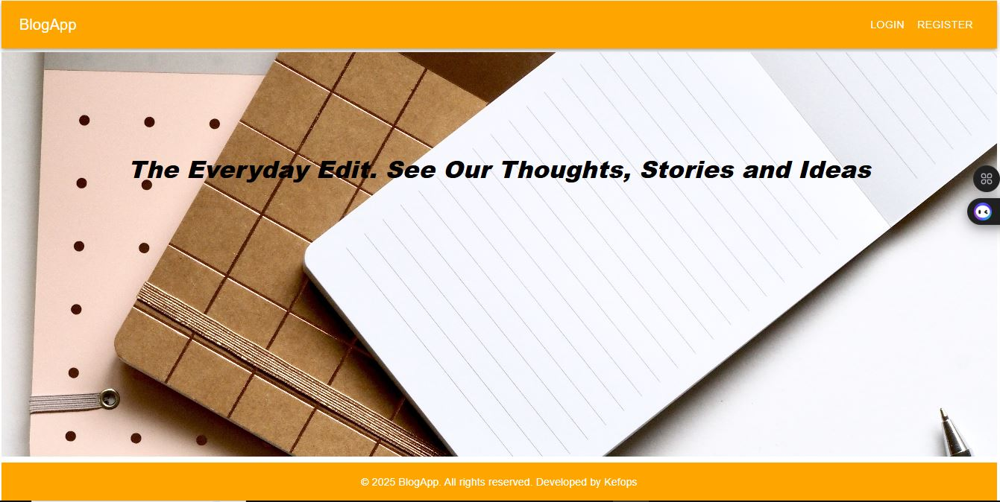

# 📝 BlogApp

**BlogApp** is a modern, responsive blogging platform where users can create, read, update, and delete blog posts. It provides a clean writing experience with a minimal UI and supports user authentication, rich-text editing, and personalized dashboards.

## 🚀 Features

- ✍️ Create and edit blog posts
- 📖 Read full articles on clean UI pages
- 🔒 User authentication (Login/Register)
- 📋 Personalized dashboard for managing your blogs
- 🌙 Light and Dark Mode (optional)
- 🔔 Toast notifications for actions
- 📱 Fully responsive design

## 🛠 Tech Stack

- **Frontend**: React, TypeScript, Material UI, React Router
- **State Management**: Zustand or React Context
- **Data Fetching**: Axios + React Query
- **Styling**: MUI `sx` prop and custom themes


## 📸 Screenshots

| Home Page | 
|-----------|
|  | 

## ⚙️ Installation

1. **Clone the repository**
   ```bash
   git clone https://github.com/KE-FA/BlogApp.git
   cd BlogApp

2. **Install dependencies**
    ```bash
    npm install
    ```

3. **Run the app**
   ```bash
    npm run dev
   ```

## Made By Kedevs 😎
